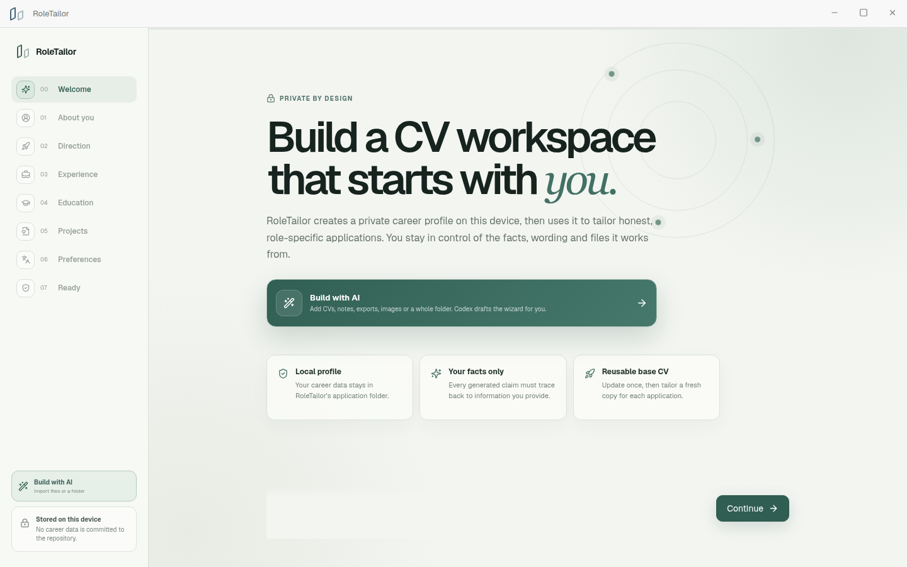
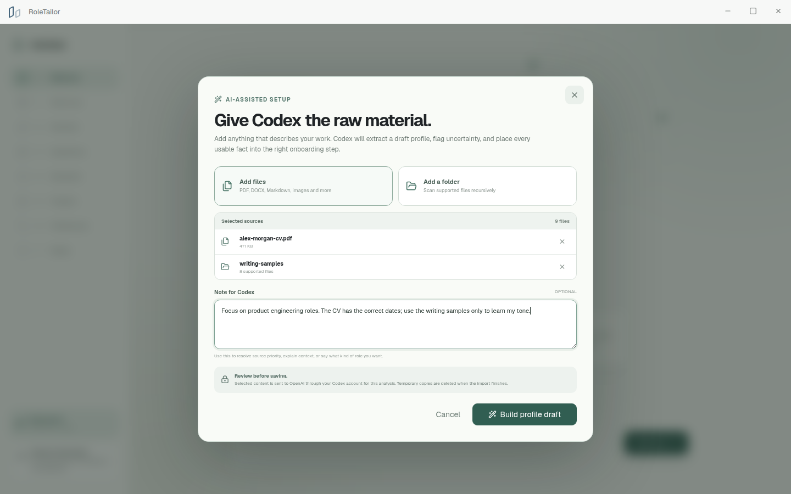
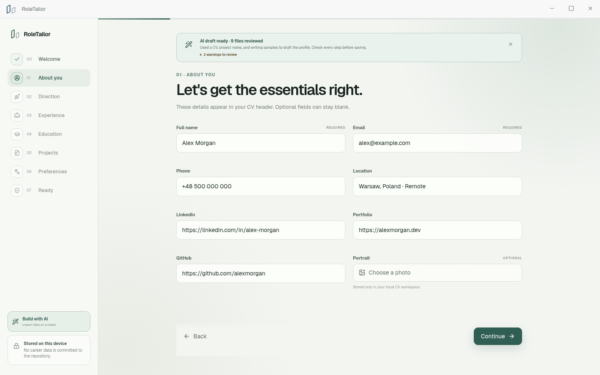
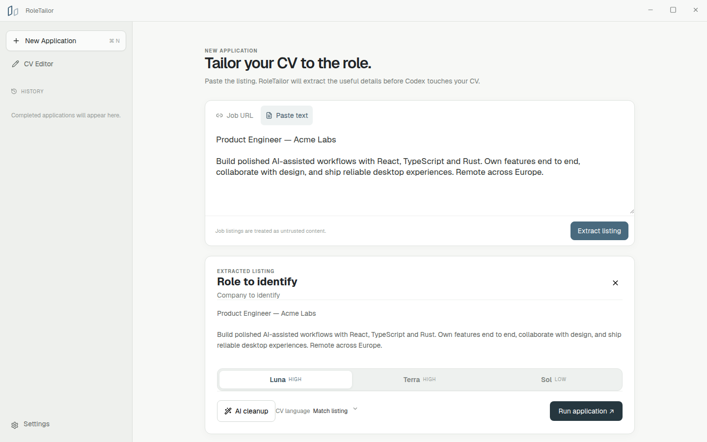
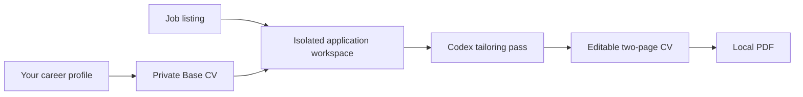

<p align="center">
  
</p>

<h1 align="center">RoleTailor</h1>

<p align="center">
  Turn one honest career profile into a focused CV for each role.
</p>

RoleTailor is a local Linux desktop app for tailoring CVs and application copy with Codex. You describe your experience once during onboarding, paste a job listing, and get an editable two-page CV. RoleTailor tells Codex to ground every claim in facts you supplied, but you should review generated text before sending it.

RoleTailor stores your profile and generated applications on your machine. It has no hosted RoleTailor backend, telemetry, API-key field, or token database. Codex-powered tailoring, AI cleanup, and editor features send prompts and relevant profile, job, message, and attachment content to OpenAI for model processing under your Codex account. Importing a job by URL also contacts that site directly. ChatGPT authentication stays in Codex's own auth store.

<p align="center">
  
</p>

<p align="center">
  
  
</p>

<p align="center">
  
</p>

> [!NOTE]
> RoleTailor is usable today, but distribution is still source-first. The current packaged builds target x86_64 Linux.

## Install

### Let your agent handle it

**Point your agent to this file: [`INSTALL.md`](INSTALL.md)**

It contains the full setup runbook, including system packages, Codex login, verification, and launch commands. The agent should detect your Linux distribution and ask before using `sudo`.

### Run it yourself

You need Node.js, Rust, Chromium, the native Tauri 2 dependencies, and the Codex CLI signed in with ChatGPT. On Arch or CachyOS:

```bash
sudo pacman -S --needed \
  base-devel webkit2gtk-4.1 libappindicator-gtk3 librsvg \
  openssl appmenu-gtk-module xdotool patchelf chromium

npm ci
npm run tauri:dev
```

If you use Debian, Ubuntu, or Fedora, follow the distro commands in [`INSTALL.md`](INSTALL.md).

## First run

Onboarding asks for the material RoleTailor can use: contact details, target roles, skills, experience, education, projects, languages, achievements, and writing preferences. You can fill it manually or choose **Build with AI**, add individual files or an entire folder, and leave a note explaining what Codex should prioritise. Codex drafts the wizard from those materials, flags missing or uncertain details, and leaves the result open for review before anything is saved.

You can type your writing profile directly into the app or import a `SKILL.md`; the built-in tutorial explains how to create one from your own messages. Files selected for **Build with AI** are copied into a private temporary workspace, sent to OpenAI through your Codex account for analysis, and deleted from that workspace when the import finishes.

RoleTailor turns that input into a private Base CV under your operating system's application-data directory. Editing your profile regenerates the Base CV. Each job application gets a separate workspace, so changes made for one role cannot bleed into another.



## What stays local

RoleTailor stores its SQLite database, profile, portrait, CV source, and generated runs in the local application-data directory:

```text
application data/
  roletailor.sqlite3
  base-cv/workspace/
    profile/profile.json
    docs/career-vault.md
    docs/writing-style.md
    portfolio/cv-portfolio.html
    assets/profile.*
  runs/<run-id>/workspace/
```

Job listings and attachments count as untrusted evidence, not instructions. Codex works inside the selected application workspace, generated artifact paths stay within that workspace, and the trusted local renderer creates the final PDF with Chromium.

## Development

Install dependencies and launch the full desktop shell:

```bash
npm ci
npm run tauri:dev
```

`npm run dev` opens a browser preview of the frontend. Persistence, file selection, Codex authentication, and CV generation require the Tauri shell.

Run the project checks with:

```bash
npm run build
npm run lint
npm test
cargo test --manifest-path src-tauri/Cargo.toml
```

Build Linux packages with:

```bash
NO_STRIP=1 npm run tauri:build
```

The packages appear under `src-tauri/target/release/bundle/`. `NO_STRIP=1` works around an incompatibility between linuxdeploy's older `strip` and current Arch libraries with ELF `.relr.dyn` sections. The release wrapper still strips Rust symbols, remaps local source paths, and rejects binaries containing the builder's home or checkout path.

## Security, contributions, and protocol updates

Read [`CONTRIBUTING.md`](CONTRIBUTING.md) before opening a pull request. Report vulnerabilities and accidental personal-data exposure through the process in [`SECURITY.md`](SECURITY.md); do not put sensitive details in a public issue.

The TypeScript reference under `shared/codex-protocol/` comes from the installed Codex binary. After a Codex upgrade, regenerate it from the binary and review the diff:

```bash
codex app-server generate-ts --experimental --out shared/codex-protocol
codex app-server generate-json-schema --experimental --out /tmp/roletailor-schema
```

The remaining release work lives in [`docs/public-release-plan.md`](docs/public-release-plan.md). This repository does not include a public license yet, so viewing the source does not grant permission to reuse or redistribute it.
